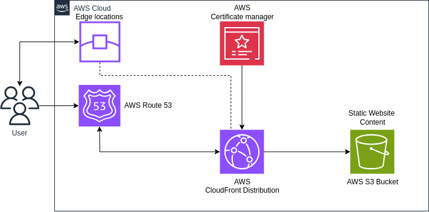

# AWS Terraform Static Website Deployment

## Introduction

This project aims to deploy a static website using AWS services, orchestrated by Terraform. The infrastructure includes an S3 bucket for hosting the static files, CloudFront as a Content Delivery Network (CDN) for caching and accelerating access, and an ACM certificate for securing the domain. The architecture is designed to route traffic from your custom domain through CloudFront to the S3 static website.

## Infrastructure Architecture

### Architecture Diagram



The diagram above illustrates the flow of traffic when a user accesses the domain. Traffic is routed to CloudFront, which then fetches the static content from the S3 bucket. The ACM certificate secures the connection by providing SSL/TLS encryption, ensuring that all traffic is encrypted.

## Prerequisites

### Software Installation

Before you begin, ensure that you have the following software installed:

- **Terraform**: Install the latest version from the official [Terraform website](https://www.terraform.io/downloads.html).
- **AWS CLI**: Install the AWS Command Line Interface from the official [AWS CLI website](https://aws.amazon.com/cli/).

### AWS Credentials Setup

Make sure you have configured your AWS credentials on your local machine. You can configure your credentials using the AWS CLI with the following command:

```sh
aws configure
```

You will be prompted to enter your AWS Access Key ID, Secret Access Key, Default region name, and Default output format.

### Setup and Initialization

Clone the project repository to your local machine using the following command:

```sh
git clone https://github.com/Gre4kas/aws-terraform-s3-static-website.git
```

Navigate to the Project Directory

```sh
cd aws-terraform-s3-static-website
```

After cloning the repository, you need to provide execution permissions to the deployment script. Run the following command:

```sh
chmod +x ./start.sh
```

### Deploying the Infrastructure

#### Apply the Terraform Configuration
To deploy the infrastructure, run the deployment script with the following command:
```sh
./start.sh apply
```

This command will initiate the Terraform plan and apply the configuration to create the necessary AWS resources. After the process is complete, Terraform will output information, including the CNAME records needed for your domain.

```
Outputs:
website_url = "<your-website-url-https-cloudfront">"
CNAME_Name = "<your.example.com>"
CNAME_Value = "<your.xyz123.aws>"
```

### Configure the DNS

#### Configure the CNAME for TLS/SSL Certification:

1. Log in to your domain registrar's DNS management panel.
- Create a new CNAME record:
  - Name (CNAME_Name): <your.example.com> (This is the subdomain or the root domain you want to point to CloudFront).
  - Value (CNAME_Value): <your.xyz123.aws> (This is the CloudFront distribution domain provided by Terraform).

2. Redirect Traffic to the Website URL:
- To ensure that your domain (<your-domain.com>) properly routes traffic to the static website, you need to redirect or point the domain to the website_url provided by Terraform in the Amazon CloudFront console:
  - Name: <your-domain.com> (or www.<your-domain.com> if you are setting up a subdomain).
  - Value: <your-website-url-https-cloudfront"> (This is the CloudFront URL where your static site is hosted).

This setup ensures that all traffic to your domain is routed through CloudFront, which then serves the content from the S3 bucket securely.

These DNS changes may take some time to propagate. Once completed, your domain should be fully configured to serve your static website over HTTPS.

## Destroying the Infrastructure

### Remove AWS Resources

When you no longer need the infrastructure, you can safely delete all the resources created by Terraform to avoid incurring unnecessary costs. To destroy the infrastructure, run the following command:

```bash
./start.sh destroy
```

After the process completes, all related AWS resources will be deleted.

## Conclusion

This README provided a comprehensive guide to deploying a static website using AWS services with Terraform. By following the steps outlined, you can easily set up, configure, and manage a scalable and secure static website hosted on AWS.

For future improvements, consider integrating automated CI/CD pipelines for continuous deployment. 